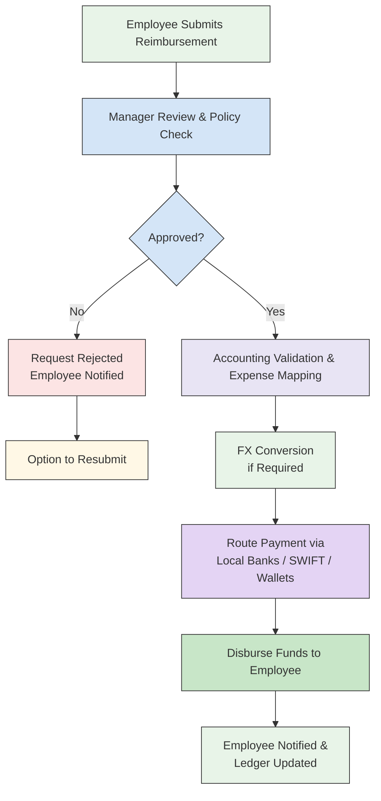

Neobanks and fintech platforms use Tazapay as an embedded infrastructure layer to move money globally without building payment rails from scratch.

## How Tazapay Helps

<CardGroup cols={2}>
  <Card title="Embedded payout and balance APIs" icon="code">
    Integrate seamlessly with your existing platform
  </Card>
  <Card title="Multi-currency holding balances" icon="coins">
    Hold and manage funds in multiple currencies
  </Card>
  <Card title="Global coverage using local payout rails" icon="globe">
    Reach beneficiaries worldwide through local payment networks
  </Card>
  <Card title="Compliance, risk checks, and settlement" icon="shield-check">
    Tazapay handles regulatory requirements and fund settlement
  </Card>
</CardGroup>

## Integration Flow

<Steps>
  <Step title="Fund Tazapay Balance">
    Platform funds or receives funds into a Tazapay balance
  </Step>
  <Step title="Credit to Holding Currencies">
    Funds are credited to one or more holding currencies
  </Step>
  <Step title="Initiate Payouts">
    Platform initiates payouts on behalf of end users
  </Step>
  <Step title="FX Conversion">
    FX conversion is applied when payout currency differs
  </Step>
  <Step title="Execute Payouts">
    Tazapay executes payouts using local rails
  </Step>
  <Step title="Track & Reconcile">
    Transaction status and reconciliation are tracked via APIs and dashboard
  </Step>
</Steps>

## Payout Flow Diagram

## APIs Involved

| Purpose | API | Endpoint |
|---------|-----|----------|
| View holding balances | [Fetch Balances](/api-reference/balances/fetch-balances) | `/v3/balances` |
| Create payout | [Create Payout](/api-reference/payouts/create-payout) | `/v3/payouts` |
| Track payout status | [Fetch Payout](/api-reference/payouts/fetch-payout) | `/v3/payouts/{id}` |
| FX conversion | [FX APIs](/api-reference/fx) | `/v3/fx` |
| Reconciliation | [Fetch Balance Transactions](/api-reference/balance-transactions/fetch-balance-transaction) | `/v3/balance_transaction/{id}` |
| Event handling | [Webhooks](/webhooks/payout-events) | `payout.*` |

## Example

<Info>
A neobank offers international payouts and multi-currency money movement to its users without building payment infrastructure in-house.
</Info>

### Using Tazapay

<AccordionGroup>
  <Accordion title="Integration Steps">
    - The neobank integrates Tazapay's payout APIs
    - User funds are routed through Tazapay's multi-currency balances
    - Cross-border transfers are executed via local payout rails
    - FX conversion, compliance checks, and settlement are handled by Tazapay
  </Accordion>
</AccordionGroup>

### Benefits

<Tabs>
  <Tab title="For the Neobank">
    - **Launch faster** — Global payout capabilities without building infrastructure
    - **Reduce complexity** — Lower operational and regulatory burden
    - **Focus on UX** — Concentrate on customer experience instead of payment infrastructure
  </Tab>
  <Tab title="Tazapay Handles">
    - Local payout execution
    - FX conversion
    - Compliance and settlement
  </Tab>
</Tabs>
