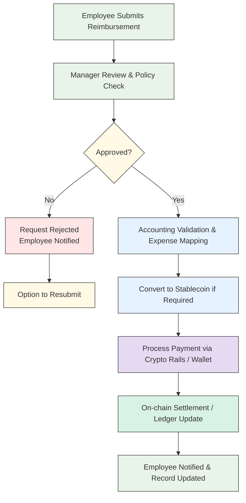

Stablecoin-native businesses often need to bridge crypto and fiat systems, especially for payroll, vendor payments, or off-ramps.

## How Tazapay Helps

<CardGroup cols={2}>
  <Card title="Stablecoin Collections" icon="coins">
    Accepts stablecoin collections (e.g., USDC, USDT)
  </Card>
  <Card title="Fiat Conversion" icon="arrows-rotate">
    Converts stablecoins to fiat where required
  </Card>
  <Card title="Global Payouts" icon="globe">
    Supports local fiat payouts across countries
  </Card>
  <Card title="Simplified Off-Ramps" icon="route">
    Reduces reliance on multiple off-ramp providers
  </Card>
</CardGroup>

## Integration Flow

<Steps>
  <Step title="Collect Stablecoins">
    Platform collects funds in stablecoins
  </Step>
  <Step title="Credit Balance">
    Funds are credited to the platform's Tazapay balance
  </Step>
  <Step title="Convert to Fiat">
    Stablecoins are converted to fiat when required
  </Step>
  <Step title="Initiate Payouts">
    Platform initiates payouts to beneficiary bank accounts
  </Step>
  <Step title="Settlement">
    Tazapay handles FX, local rails, and settlement
  </Step>
  <Step title="Track & Reconcile">
    Payout status and reconciliation are tracked via APIs and dashboard
  </Step>
</Steps>

## APIs Involved

| Purpose | API | Endpoint |
|---------|-----|----------|
| View holding balances | [Fetch Balances](/API-Reference/tazapay-api/balance/fetch-balance) | `/v3/balances` |
| Stablecoin to fiat conversion | [FX / Conversion APIs](/API-Reference/tazapay-api/common-object-schemas/fx-transaction) | `/v3/fx` |
| Create payout | [Create Payout](/API-Reference/tazapay-api/payout/create-payout) | `/v3/payouts` |
| Track payout status | [Fetch Payout](/API-Reference/tazapay-api/payout/fetch-payout) | `/v3/payouts/{id}` |
| Reconciliation | [Fetch Balance Transactions](/API-Reference/tazapay-api/balance-transaction/fetch-balance-transaction) | `/v3/balance_transaction/{id}` |
| Event handling | [Webhooks](/API-Reference/tazapay-api/payout/webhook-events) | `payout.*` |

## Example

<Card title="Stablecoin Payroll Platform" icon="building">
  A stablecoin payroll platform:
  - Receives funds in USDC
  - Uses Tazapay to convert and pay employees in local fiat
  - Offers a seamless crypto-to-fiat experience to end users
</Card>

<Info>
**Tazapay handles:**
- Stablecoin to fiat conversion
- Local payout networks
- Compliance and reconciliation
</Info>
