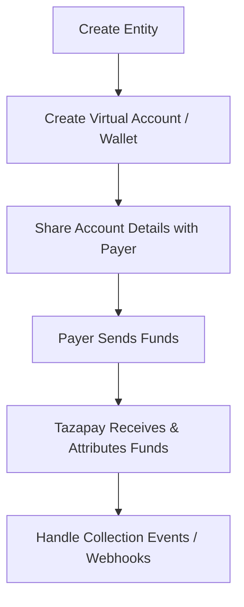

Tazapay's **Collections on Behalf Of (COBO)** capability allows platforms / fintechs to receive funds on behalf of their customers which can be individual or business. Tazapay can configure **virtual accounts** or **stablecoin wallets** for your customers to receive payments.

This ensures compliance, traceability, and correct attribution of incoming funds.

---

## High-level Flow

1. Create an **Entity** (Individual or Business)
2. Create a **Virtual Account** or **Stablecoin Wallet**
3. Share account details with the **Payer**
4. Receive and attribute **Incoming Funds**
5. Handle **Collection Events / Webhooks**

---

## Step 1: Create an Entity (Individual or Business)

An Entity represents a platform's or fintech's customer — the party on whose behalf the collection is being made. Every virtual account or wallet must be associated with an entity.

Tazapay supports two entity types:

- **Business Entity** – for registered companies
- **Individual Entity** – for individual customers (e.g., freelancers, creators, sole proprietors)

<Warning>
Only entities with status **submitted** can be used to create virtual accounts or wallets.
</Warning>

### Relevant Links

1. [Business Entity Requirements -  Full Onboarding](/Global-Money-Movement/appendix/onboarding-requirements/onboarding-requirements-businesses)
2. [Individual Entity Requirements - Full Onboarding](/Global-Money-Movement/appendix/onboarding-requirements/onboarding-requirements-individuals)
3. [Entity Requirements - Simplified Onboarding](/Global-Money-Movement/connected-accounts/simplified-entity-creation)
4. [Create Entity API - Business](/API-Reference/tazapay-api/entity/create-entity-business)
5. [Create Entity API - Individual](/API-Reference/tazapay-api/entity/create-entity-individual)
6. [Submit Entity API - Business](/API-Reference/tazapay-api/entity/submit-entity-business)
7. [Submit Entity API - Individual](/API-Reference/tazapay-api/entity/submit-entity-individual)

---

## Step 2: Create a Virtual Account or Stablecoin Wallet

Once you have a submitted entity, you can create a collection destination for them.

Tazapay supports two collection destination types:

<CardGroup cols={2}>
  <Card title="Virtual Accounts" icon="building-columns">
    Bank account numbers that can receive local or international transfers. Funds are automatically attributed to the associated entity.
  </Card>
  <Card title="Stablecoin Wallets" icon="wallet">
    Blockchain wallet addresses for receiving stablecoin payments (e.g., USDC, USDT). Ideal for crypto-native businesses.
  </Card>
</CardGroup>

### Virtual Account Features

| Feature | Description |
|---------|-------------|
| Multi-currency | Support for multiple currencies per entity |
| Local rails | Receive domestic transfers with local account numbers |
| International | Receive SWIFT/wire transfers |
| Auto-reconciliation | Incoming funds automatically matched to entity |

### Stablecoin Wallet Features

| Feature | Description |
|---------|-------------|
| Supported tokens | USDC, USDT (network availability varies) |
| Networks | Multiple blockchain networks supported |
| Auto-conversion | Optional conversion to fiat on receipt |
| Real-time | Near-instant settlement |

### Relevant Links

- [Configure Virtual Accounts and Stablecoin Wallets](/Global-Money-Movement/global-collection-accounts/configuring-virtual-accounts-and-stablecoin-wallets)
- [Collection Account Webhooks](/API-Reference/tazapay-api/collection-account/webhook-events)

---

## Step 3: Share Account Details with Payer

Once the virtual account or wallet is created, share the account details with the payer (your customer's customer or counterparty).

<Tip>
You can retrieve the account details programmatically via API and display them in your platform's UI, or send them directly to the payer via email or invoice.
</Tip>

### Virtual Account Details Include

- Account number / IBAN
- Bank name and address
- SWIFT/BIC code (for international transfers)
- Routing number (for local transfers)
- Reference code (for attribution)

### Stablecoin Wallet Details Include

- Wallet address
- Supported networks
- Supported tokens

### Relevant Links

1. [Viewing Virtual Accounts and Stablecoin Wallets](/Global-Money-Movement/global-collection-accounts/viewing-virtual-accounts-and-stablecoin-wallets)

---

## Step 4: Receive and Attribute Incoming Funds

When a payer sends funds to the virtual account or wallet:

1. Tazapay receives the incoming transfer
2. Funds are automatically attributed to the associated entity
3. A webhook notification is sent to your platform

---

## Step 5: Handle Collection Events & Webhooks

Tazapay sends **webhooks** to notify you of collection events. You should always rely on webhooks (not polling) for real-time fund attribution.

### Relevant Links

1. [Collect Webhook Events](/API-Reference/tazapay-api/collect/webhook-events)
2. [Collect State Machine](/API-Reference/tazapay-api/collect/collect-state-machine)
3. [Get Collect API](/API-Reference/tazapay-api/collect/fetch-collect)

### Best Practices

<Steps>
  <Step title="Verify Webhook Signatures">
    Always validate webhook signatures to ensure authenticity and prevent spoofing.
  </Step>
  <Step title="Implement Idempotency">
    Handle duplicate webhook deliveries gracefully by tracking processed event IDs.
  </Step>
  <Step title="Store Event History">
    Maintain a log of all collection events for reconciliation and audit purposes.
  </Step>
  <Step title="Monitor for Anomalies">
    Set up alerts for unexpected collection patterns or failed attributions.
  </Step>
</Steps>
