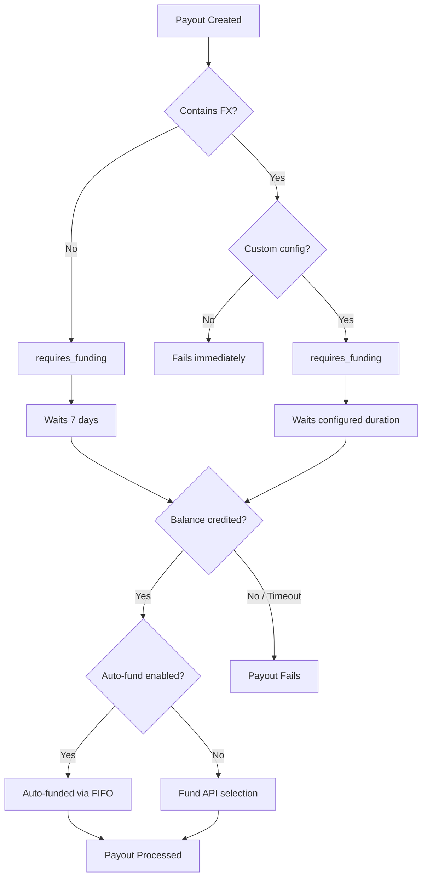

Tazapay allows you to create a payout and fund it later. This is useful when you need to initiate payouts before funds are available in your account.

## How It Works

## Default Behavior

| Payout Type | Default Behavior | Waiting Period |
|-------------|------------------|----------------|
| Without FX | Moves to `requires_funding` | 7 days |
| With FX | Fails immediately | None (configurable) |

<Info>
Payouts without FX transactions automatically move to the `requires_funding` state and wait for 7 days before failing.
</Info>

<Warning>
Payouts containing FX transactions will fail immediately by default. You must enable the funding window configuration to allow deferred funding for FX payouts.
</Warning>

## Funding Mechanisms

### Automatic Funding (Default)

When your balance receives a credit, payouts in the `requires_funding` state are automatically funded using a **FIFO (First In, First Out)** mechanism based on creation time.

<Tip>
The FIFO mechanism ensures that your oldest pending payouts are funded first, maintaining fair processing order.
</Tip>

### Selective Funding via API

You can disable auto-funding and use the Fund API to selectively fund specific payouts. This gives you full control over which payouts get funded.

**Use cases for selective funding:**

- Your customers fund you after payout creation on your platform
- You need to prioritize certain payouts over others
- You want to match specific incoming funds to specific payouts

## Enabling FX Payout Funding Window

By default, payouts containing FX transactions fail immediately if there's insufficient balance. To enable a funding window for FX payouts:

<Steps>
  <Step title="Contact Support">
    Reach out to [support@tazapay.com](mailto:support@tazapay.com) or your account manager.
  </Step>
  <Step title="Request Configuration">
    Specify the time duration you need for the funding window.
  </Step>
  <Step title="Confirmation">
    Tazapay will configure the custom duration for your account.
  </Step>
</Steps>

## Configuration Options

| Option | Description | How to Enable |
|--------|-------------|---------------|
| FX funding window | Allow FX payouts to wait for funding | Contact support |
| Disable auto-funding | Use Fund API for selective funding | Contact support |

<Note>
To disable automatic FIFO funding and use selective funding via the Fund API, contact [support@tazapay.com](mailto:support@tazapay.com) or your account manager.
</Note>

## Relevant Link
- [Fund Payout API](/API-Reference/tazapay-api/payout/fund-payout)
